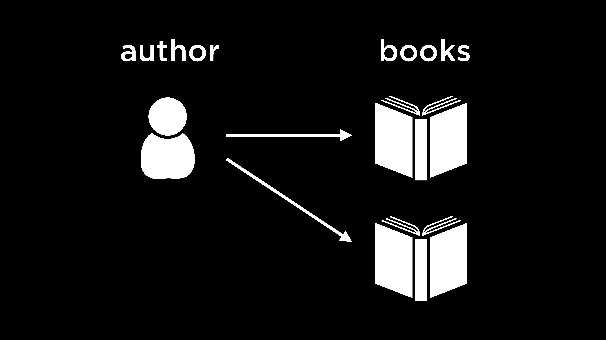
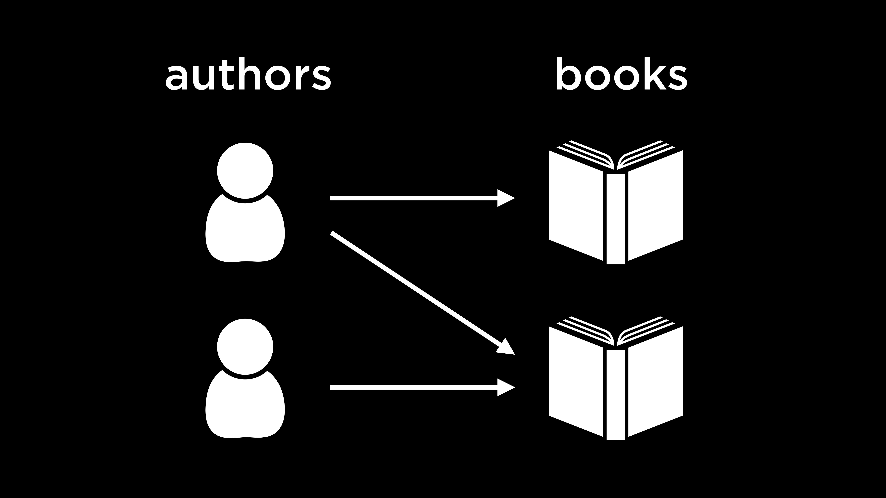
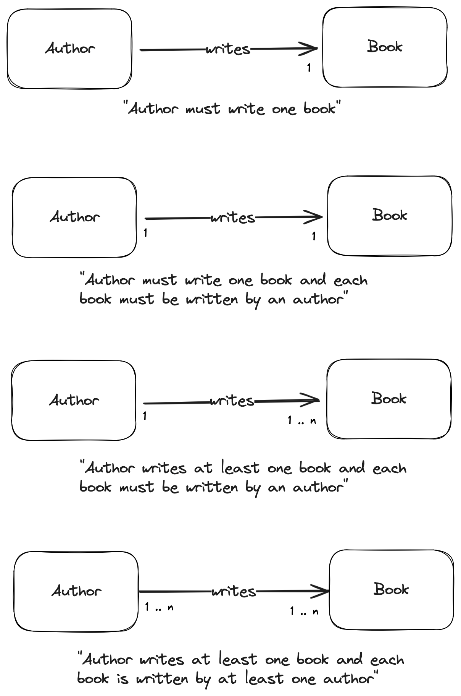

> [!WARNING]
> This section is under development

# Week 2

TODO inspirational quote


## Topics

- [Constraints](#constraints)
- [Creating your first database]()
- TODO
- TODO

## Constraints

### Primary Keys 

Let’s return to our example `world` database introduced in [Week 1](../week1/README.md). Recall that we had three tables: `country`, `city`, and `countrylanguage`.

Each of these tables has a column (or set of columns) that uniquely identify each row of that table:
    - `code` from `country`
    - `id` from `city`
    - `country_code` and `language` from `countrylanguage`

These special columns are called **primary keys**.

Primary keys have a few requirements:
    - None of the values can be `NULL`.
    - Each value must be unique (that is, you can’t have two countries with the same `code` in the `country` table).
    - A table can not have more than one primary key.

Sometimes, having a single column uniquely identify a row is not enough. In this case, multiple columns can be used together to form a **composite primary key**. That's the scenario we see in the `countrylanguage` table:
    - There can be multiple languages per country (so `country_code` could not be a primary key)
    - The same language can be used in multiple countries (so `language` could not be a primary key)
    - Per each country, we only expect one entry per language. A composite key of `country_code` and `language` is useful

### Foreign Keys

Let’s reexamine the `city` table:

```sql
-- +----+----------------+-------------+---------------+------------+
-- | ID | Name           | CountryCode | District      | Population |
-- +----+----------------+-------------+---------------+------------+
-- |  1 | Kabul          | AFG         | Kabol         |    1780000 |
-- |  2 | Qandahar       | AFG         | Qandahar      |     237500 |
-- |  3 | Herat          | AFG         | Herat         |     186800 |
-- |  4 | Mazar-e-Sharif | AFG         | Balkh         |     127800 |
-- |  5 | Amsterdam      | NLD         | Noord-Holland |     731200 |
-- |  6 | Rotterdam      | NLD         | Zuid-Holland  |     593321 |
-- |  7 | Haag           | NLD         | Zuid-Holland  |     440900 |
-- |  8 | Utrecht        | NLD         | Utrecht       |     234323 |
-- |  9 | Eindhoven      | NLD         | Noord-Brabant |     201843 |
-- | 10 | Tilburg        | NLD         | Noord-Brabant |     193238 |
-- (...)
```

As mentioned earlier in [Week 1 - Combining Tables](../week1/README.md#combining-tables), the values of `city.countrycode` match the values of `country.code` (the primary key for `country`).

When the primary key for one table appears in a different table, it is called a **foreign key**.

So `code` is a primary key when it appears in `country`, but a foreign key when it appears in `city`. The most common types of joins will be joining a foreign key from one table with the primary key from another table.

>[!IMPORTANT]
> When a column is set as a foreign key, its value *must* exist in the original table as foreign key. For example, inserting a row with `countrycode = 'XXX'` into the `city` table is not possible because there's no country with code 'XXX' in the `country` table.

> [!NOTE]
> In the `city` table, the values for column `name` are also unique, so it could also be used as a primary key. However, generally, the primary key will just be called `id`.

### `UNIQUE`, `NOT NULL`, and `DEFAULT`

Primary key and foreign keys are the so called table level constraints. There are other constraints that apply only to the values of individual columns. 

Here are some of the column constraints that can be set:

- `UNIQUE` columns have a different value for every row. This is similar to primary key except a table can have many different `UNIQUE` columns.
    - For example, the `country.name` can be `UNIQUE` (there shouldn't be 2 countries with the same name), even though `code` is the primary key
- `NOT NULL` columns must have a value. Attempts to insert a row without a value for a `NOT NULL` column will result in a constraint violation and the new row will not be inserted.
    - For example, we may say that `population` of a country is important information and we'd like to prevent having rows that don't set it
- `DEFAULT` columns are configured to have a given value automatically set if the new row does not specify a value for that column.
    - For example, we could set `isOfficial` to *true* ('T') whenever a new row is added to `countrylanguage`, if a value is not specified

> [!NOTE]
> We'll talk more about how to set these constraints in the ["Creating your first database"](#creating-your-first-database) section.


## Creating your first database<sup>[[2]](#references)</sup>

In this section, we will learn how to design our own database schemas.

Thus far, we worked with a finished `world` database. Now, we will look underneath the hood and see what steps can be used to create such a database.

We are tasked with representing a book review website through a database schema. This includes the books, authors, translators, publishers, and book ratings.

To break down the question further, we need to decide…
- what kinds of tables we will have in our 'books' database,
- what columns each of the tables will have, and
- what types of data we should put in each of those columns.

### Types of Relationships

TODO connection intro

Let us look at some different ways in which tables can be related to each other in relational databases.

Consider this case, where each author writes only one book and each book is written by one author. This is called a one-to-one relationship.


On the other hand, if an author can write multiple books, the relationship is a **one-to-many relationship**.



But actually, neither of those reflect reality. Not only can one author write multiple books, but books can also be co-written by multiple authors. This is a **many-to-many** relationship.



> [!IMPORTANT]
> There are 3 types of relationships in the relational model:
> - **one-to-one** relationships
> - **many-to-one** relationships
> - **many-to-many** relationships

### Entity Relationships Diagrams

We just described one-to-one, one-to-many and many-to-many relationships between tables in a database. It is possible to visualize such relationships using an entity relationship (ER) diagram.

ER diagrams are a useful way to design and explain the conceptual model for a database before creating the database itself. ER diagrams are easy to understand even without a technical background. 

Also, it's relatively simple to convert ER diagrams to the Relational Model (that is, to a SQL representation). Therefore, when designing a relational database, it's common to start by mapping an ER diagram.

Here's an ER diagram for the `book review` problem:


Each entity (Author, Publisher, etc) will be a table in our database. The relationship between the tables, or entities, are represented by the *verbs* that mark the arrows connecting entities.

The diagram is following the UML notation (**simplified**):
- `0` - no relations
- `1` - one relation
- `n` - many relations

These can be used together to represent the 3 types of relationships:
- Many-to-one: `n -> 1`
    - Or variants like: `n -> 0..1`
- One-to-one: `1 <-> 1`
    - Or variants like: `0..1 <-> 0..1`
- Many-to-many: `n <-> n`
    - Or variants like: `1..n <-> n`

Here are some examples:


Let's revisit the ER diagram for the `book review` problem:


By observing the lines connecting the Book and Translator entities, we can say that books don't **need** to have a translator (`n <-> 0..n`). However, a translator in this database translates at least one book, and possibly many.

Let's see if you got it! Try to answer the following questions:
- How many ratings can each book have?
- Must each publisher have published at least 1 book?
- Can a book be published by more than one publisher?
- Can a book have a single translator?

<details>
<summary>View solution</summary>

- How many ratings can each book have?
    - Zero or more (`0..n`)
- Must each publisher have published at least 1 book?
    - Yes. The relationship `Publisher <-> Book` has `1 .. n` on the Book side
- Can a book be published by more than one publisher?
    - No. The relationship `Publisher <-> Book` has `1` on the Publisher side
- Can a book have a single translator?
    - Yes. It can also have no translator or many
</details>

## References

[2] Adapted from [CS50’s Introduction to Databases with SQL](https://cs50.harvard.edu/sql/2024/notes/2/) 

> [!NOTE]
> The following sections are drafts

### Data types

You've probably noticed by now that in the `world` database, the columns have different types of data. Some column values are filled with numbers - like `country.population`, and`countrylanguage.percentage` - others have text - like `country.name`, and `city.district`. Let's looks a bit deeper into what different data types SQL supports and how they work.

Data types provide categories for values stored in the tables. Types are assigned to fields through table creation and are responsible for determining some of the attributes and constraints of data stored within a given table.

SQL supports a range of data types across widely used classes of data, such as the following:
- Numeric types
- String or character types
- Temporal types for dates and times

These data types are found across all flavors of SQL (for example SQLite, and PostgreSQL). However, some versions of SQL may support several distinct data types of a particular class while others may only have one.

Here are the N main data types supported by MySQL;

TODO